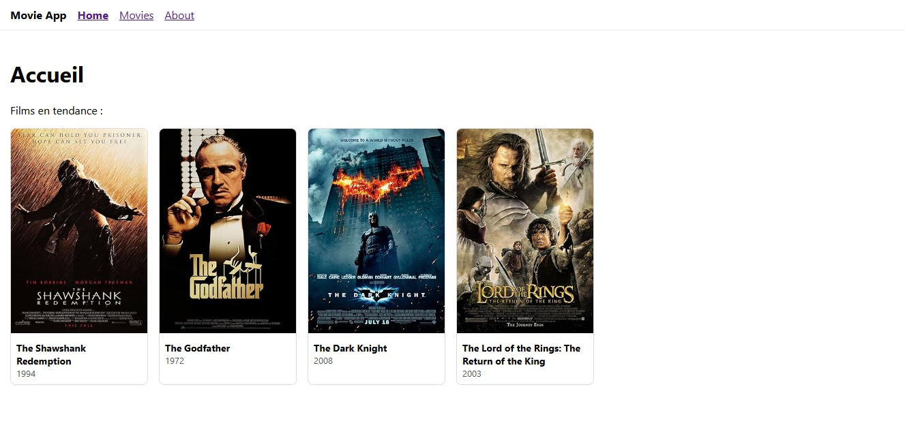
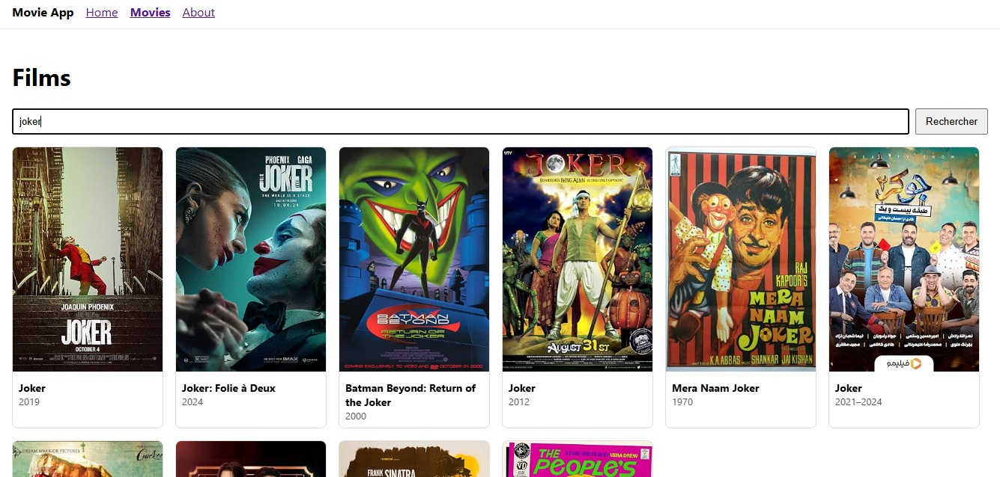

# 🎬 MOVIE APP – REACT JS

--- 
<p align="center">
  
</p>
<p align="center">
  
</p>

Mini-application développée dans le cadre du module Développement Front-End (M204) – DEVOWFS-201 (ISTA Ouarzazate).

Cette application permet de rechercher des films, d’afficher les résultats sous forme de cartes, de consulter les détails complets d’un film, et de visualiser une liste de films en tendance.

---

## 🚀 Fonctionnalités

### 🔍 Recherche de films

* Formulaire de recherche (composant SearchForm)
* Affichage des résultats sous forme de cartes (MovieCard)
* Utilisation de l'API OMDb : [http://www.omdbapi.com/?apikey=4a3b711b&s=TERM](http://www.omdbapi.com/?apikey=4a3b711b&s=TERM)

### 🎬 Affichage des films en cartes

Chaque carte de film affiche :

* L’affiche (poster)
* Le titre
* L'année
* Un lien vers la page des détails

### 📄 Détails d’un film (MovieDetails)

Affiche :

* Synopsis
* Acteurs
* Genre
* Note IMDB
* Image HD
  API utilisée : [http://www.omdbapi.com/?apikey=4a3b711b&i=ID_DU_FILM](http://www.omdbapi.com/?apikey=4a3b711b&i=ID_DU_FILM)

### ⭐ Page Home (Films en tendance)

Films obligatoires : ['tt0111161', 'tt0068646', 'tt0468569', 'tt0167260']

### ℹ️ Page About

Informations sur l’application et le projet.

### 🧭 Navigation (Navbar)

* Home
* Movies
* About

---

## 🗂️ Structure du projet

```
src/
├── components/
│   ├── SearchForm.js
│   ├── MovieCard.js
│   └── Navbar.js
├── pages/
│   ├── About.js
│   ├── Home.js
│   ├── Movies.js
│   └── MovieDetails.js
├── App.jsx
└── main.jsx
```

---

## 🔧 Installation et lancement du projet

1️⃣ Cloner le projet

```
git clone https://github.com/Ayoub-glitsh/movie-app.git
cd movie-app
```

2️⃣ Installer les dépendances

```
npm install
```

3️⃣ Lancer l’application

```
npm start
```

L'application sera disponible sur : [http://localhost:5173/](http://localhost:5173/) (ou un autre port)

---

## 🌐 API utilisée : OMDb

Site officiel : [https://www.omdbapi.com/](https://www.omdbapi.com/)
Clé API gratuite fournie dans le sujet : apikey = 4a3b711b

---

## 📝 Grille d’évaluation (CC2)

| Partie         | Note   |
| -------------- | ------ |
| SearchForm     | 2 pts  |
| MovieCard      | 2 pts  |
| Navbar / About | 1 pt   |
| Home           | 2 pts  |
| Movies         | 2 pts  |
| MovieDetails   | 1 pt   |
| Total          | 10 pts |

---

## 📌 Technologies utilisées

* React.js
* React Router
* Fetch API
* JavaScript (ES6+)
* HTML / CSS

---

## 👨‍💻 Auteur

Ayoub Aguezzar
Projet réalisé pour le module Développement Front-End – React (DEVOWFS-201)
